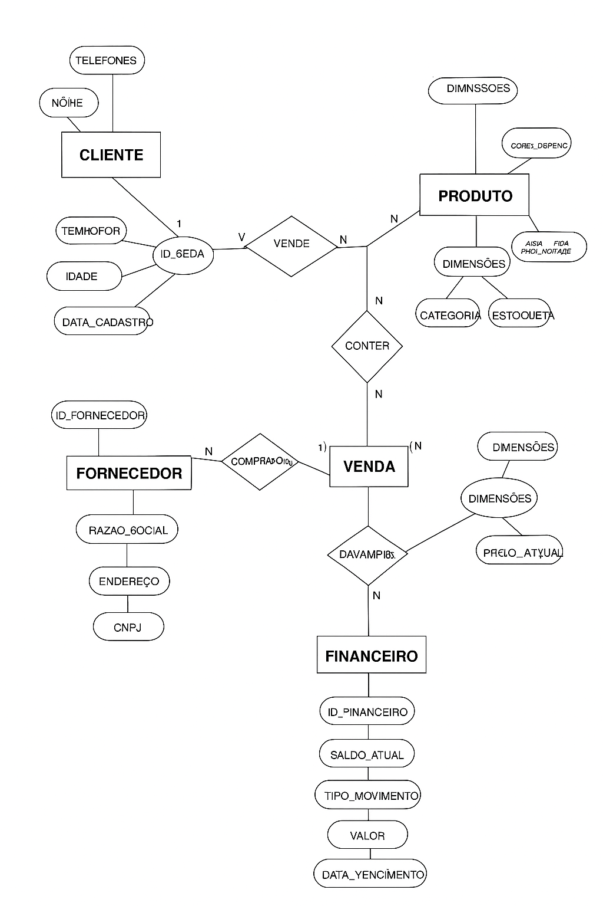
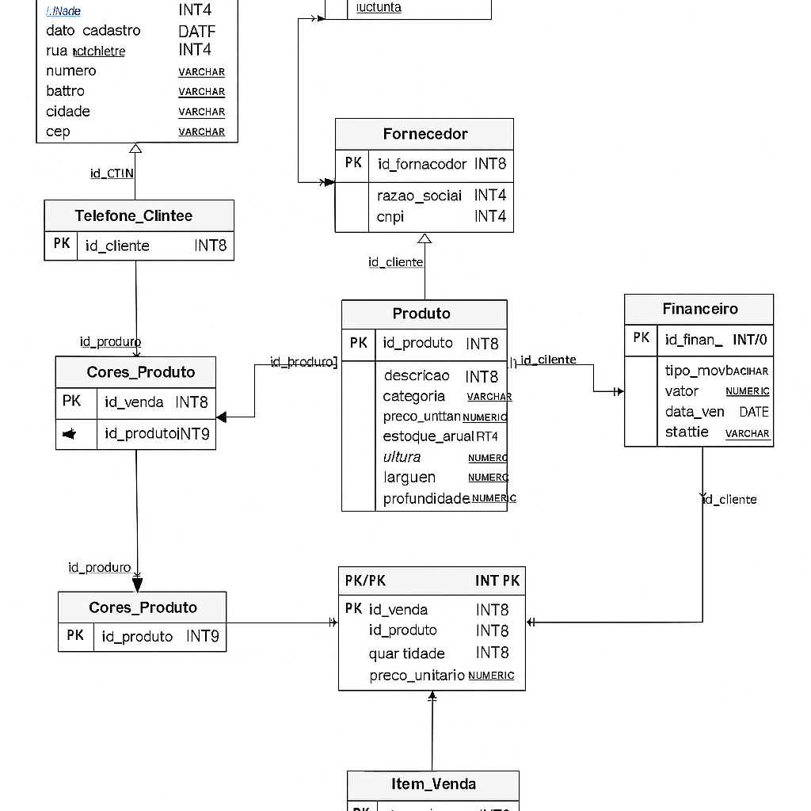

# 🏢 Sistema Comercial - Loja Nova Era Ltda.

## 📌 Cenário
A **Loja Nova Era Ltda.** é uma empresa de médio porte especializada em eletrônicos e acessórios.  
O sistema comercial foi desenvolvido para integrar **vendas, estoque, clientes, fornecedores e financeiro**, eliminando o uso de planilhas isoladas e garantindo maior eficiência.

---

## 🧩 Modelagem Conceitual
- **Entidades:** Cliente, Produto, Venda, Fornecedor, Financeiro, Item_Venda.  
- **Atributos:** simples, compostos, multivalorados e derivados.  
- **Relacionamentos:**  
  - 1:1 → Cliente ↔ Financeiro  
  - 1:N → Cliente → Venda, Fornecedor → Produto  
  - N:N → Venda ↔ Produto (resolvido com Item_Venda)  

📊 **Diagrama Grafico DER:** 

**Diagrama Texto DER:**  

[CLIENTE] ------------------ (1:1) ------------------ [FINANCEIRO]
   | (1:N)
   |
   v
 [VENDA] ------------------ (N:N) ------------------ [PRODUTO]
                               |
                               v
                         [ITEM_VENDA]

[FORNECEDOR] ------------------ (1:N) ------------------ [PRODUTO]

📊 **Diagrama Lógico:** 

---

## 📊 Modelagem Lógica
Transformação em tabelas relacionais com chaves primárias e estrangeiras.  
  Scripts disponíveis em [`scripts_sql/01-modelagem/01-logica`](scripts_sql/01-modelagem/02-logica/01-logica.sql)

---

## 🧱 Modelagem Física
Implementação em SQL (Supabase/PostgreSQL).  
Inclui criação de tabelas com tipos de dados, restrições e relacionamentos.  
  Scripts disponíveis em [`scripts_sql/01-modelagem/02-fisica'](scripts_sql/01-modelagem/01-fisica/01_fisica.sql).

---

## 📂 Dados
- Inserção de **500 registros em cada tabela**.  
- Scripts disponíveis em [`scripts_sql/02-insercao-dados`](scripts_sql/02-insercao-dados).

- Link dos scripts individuais.  

  Scripts cliente em [`scripts_sql/02-insercao-dados/02_01-cliente.sql`](scripts_sql/01-modelagem/01-fisica/01_fisica.sql).

  Scripts dados_telefonico em [`scripts_sql/02-insercao-dados/02_02-insercao_dados_telefone_cliente.sql`](scripts_sql/02-insercao-dados/02_02-telefone_cliente.sql).

  Scripts fornecedor em [`scripts_sql/02-insercao-dados/02_03-fornecedor.sql`](scripts_sql/02-insercao-dados/02_03-fornecedor.sql).

  Scripts contato_fornecedor em [`scripts_sql/02-insercao-dados/02_04-contato_fornecedor.sql`](scripts_sql/02-insercao-dados/02_04-contato_fornecedor.sql).

  Scripts produto em [`scripts_sql/02-insercao-dados/02_05-produto.sql`](scripts_sql/02-insercao-dados/02_05-produto.sql).

  Scripts cores_produto em [`scripts_sql/02-insercao-dados/02_06-cores_produto.sql`](scripts_sql/02-insercao-dados/02_06-cores_produto.sql).

  Scripts dados_venda em [`scripts_sql/02-insercao-dados/02_07-dados_venda.sql`](scripts_sql/02-insercao-dados/02_07-dados_venda.sql).

  Scripts item_venda em [`scripts_sql/02-insercao-dados/02_08-item_venda.sql`](scripts_sql/02-insercao-dados/02_08-item_venda.sql).

  Scripts financeiro em [`scripts_sql/02-insercao-dados/02_09-financeiro.sql`](scripts_sql/02-insercao-dados/02_09-financeiro.sql).

---

## 🔄 CRUD
Demonstração das operações básicas:  
- **Create (INSERT)**  
- **Read (SELECT)**  
- **Update (UPDATE)**  
- **Delete (DELETE)**  

📂 Scripts das operações estão na pasta [`/scripts_sql/03-crud`](/scripts_sql/03-crud/).

📸 Prints das operações estão na pasta [`prints_crud/`](prints_crud/).

---

## 📑 Relatórios
10 consultas SQL com `SELECT`, `WHERE`, `ORDER BY` e `JOIN`, respondendo perguntas relevantes ao cenário:  
- Clientes e suas últimas vendas  
- Produtos mais vendidos  
- Vendas por cliente  
- Fornecedores e seus produtos  
- Contas a receber pendentes  
- Vendas por forma de pagamento  
- Produtos vendidos por cliente específico  
- Clientes com mais de um telefone  
- Produtos e suas cores disponíveis  
- Fluxo financeiro por cliente  

Scripts disponíveis em [`scripts_sql/04-relatorio`](scripts_sql/04-relatorio/).

---

## ✅ Conclusão
Este repositório entrega:  
- Modelagem conceitual, lógica e física.  
- Scripts SQL completos.  
- Dados de teste (500 registros por tabela).  
- Operações CRUD demonstradas.  
- Relatórios relevantes ao cenário comercial.  

---
